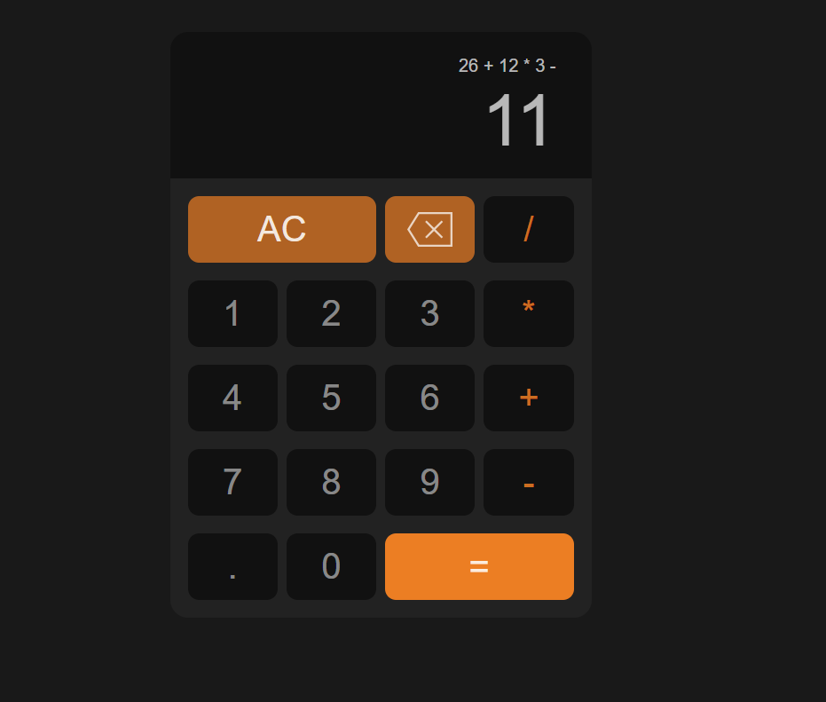

# Browser Calculator App

Hello. Good to have you here. This is a calculator app made using React and Typescript. I made this to test and improve my developer skills. Since it's a web application, all you need to run the project is a web browser. <br> 
I'll show you how to run the program locally on your own machine, but you can also check it online [here](https://react-calculator-gheb.onrender.com).

## Running on local machine
### Dependencies
In order to build and run the project in your machine, you’re gonna need to download and install some dependencies first, such as React, Typescript and Vite. You can use a package manager to do it for you. I recommend using npm. You can download [npm here](https://nodejs.org/en/download/package-manager). You can run the command ```npm -v```
 on your terminal to see if npm was successfully installed.
 If you see a message showing the software version then you’re good to go. <br />
 To install all dependencies required you’re gonna have to open the terminal on the project's root directory and run the following command: ```npm install```. After a few seconds all dependencies should be installed. You can see that a new directory called ```node_modules``` was created for you. All dependencies are located there.

 ### Running the project
 Now everything is set to run the program. To run the project you can type the following command ```npm run dev```. You should see a message on your terminal informing the correct path to access like ```http://localhost:5173```. Just paste this on any web browser of your choice and you’ll see the app running on your screen.




